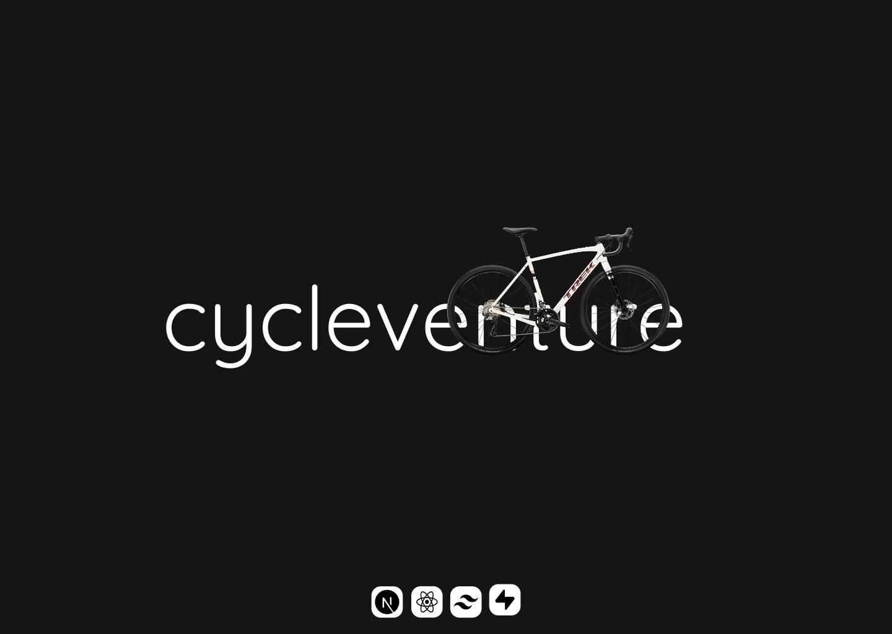

# 🚴‍♂️ Cycleventure

Welcome to **Cycleventure** — an e-commerce web app built with **Next.js**, **Supabase**, and **Zustand**.  
The goal of this project is to create a fully functional online bicycle store with features like user authentication, product listings, shopping cart, and (soon) order management.

---

## 📚 Table of Contents

- [Introduction](#introduction)
- [Live Demo](#live-demo)
- [Features](#features)
- [Technologies Used](#technologies-used)
- [Getting Started](#getting-started)
- [Screenshots](#screenshots)
- [Author](#author)

---

## 🧭 Introduction

**Cycleventure** is designed to provide a seamless shopping experience for bicycle enthusiasts. It leverages modern web technologies to ensure performance, scalability, and a smooth user experience.

---

## 🔗 Live Demo

Check it out 👉 [Cycleventure Live](https://cycleventure.vercel.app/)

---

## 🚀 Features

- ✅ User authentication and authorization via Supabase  
- ✅ Product listings with pricing
- ✅ Product Preview for each bike with detailed info
- ✅ Sorting and filtering to enhance browsing
- ✅ Cart support for both guests and signed-in users
- 🛠️ Order management system *(Coming Soon!)*
- ✅ Fully responsive design (mobile, tablet, desktop)
- ✅ Real-time state updates using Zustand  

---

## 🧰 Technologies Used

| Tech         | Purpose                                       |
|--------------|-----------------------------------------------|
| **Next.js**  | Frontend framework with SSR/SSG               |
| **Supabase** | Backend-as-a-Service (Auth, DB, Storage)      |
| **Zustand**  | State management for React                    |
| **Tailwind** | Utility-first CSS framework for styling       |

---

## 🛠️ Getting Started

### 1. Clone the repo

```bash
git clone https://github.com/yourusername/cycleventure.git
cd cycleventure
```

### 2. Install dependencies

```bash
npm install
# or
yarn
```

### 3. Set up environment variables

Create a `.env.local` file in the root:

```env
NEXT_PUBLIC_SUPABASE_URL=your_supabase_url
NEXT_PUBLIC_SUPABASE_ANON_KEY=your_supabase_anon_key
```

### 4. Run the development server

```bash
pnpm dev
```

Visit: `http://localhost:3000`

---

## 📸 Screenshots

_Coming soon..._

---

## 📬 Author

Made with ❤️ by [@AtanasovCode](https://github.com/AtanasovCode/)

---